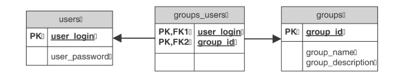

# UTP
Universal programming techniques
PJWSTK UTP course

## (1)Generics 
  Implementation of IContainer interface by custom simple data Container
  that implements IAggregable<TElement extends IAggregable<TElement,TResult>, TResult>
  and IDeeplyCloneable<TElement extends IDeeplyCloneable<TElement>> interfaces
  that aggregate elements of Container and Clone them respectively.
  
## (2)Functional programming 
  Using functional programming features available since Java 8 specified functionality 
  for for the given class hierarchy is implemented.

## (3)Lambda expressions
  Modification of previous assignment adding functionality that uses lambdas.
  
## (4)Collections - Introduction
  Reading Person data from file. Storing this data in Lists, quick filtering this data to Map
  and sorting of data using custom implementation of Comparable<TValue> interface. 

## (5)Collections - priority queues
  Multi-threaded application based on requestor-service architecture. 
  Requestor puts tasks in a queue with randomly generated priority.
  Service gets requests processes data and returns answers back.
  Everything loops infinitely.
  There are several requestors and services running simultaneously.

## (7)Stream (pipeline) processing
  Utility classes provide possibility to:
    find files or directories by name in the given directory, zip or archive;
    find files with given content in the given directory, zip or archive;

## (8)Input/Output streams
  Modification of assignment 4. Storing data using DataOutputStream in a binary file.
  Restoring data from binary file with DataInputStream.

## (10)Java Database Connectivity

Application that stores data in relational database with JDBC in schema as above.
Application does enable all CRUD operations (Create-Read-Update-Delete) that are difined by IGroupRepository interface.
